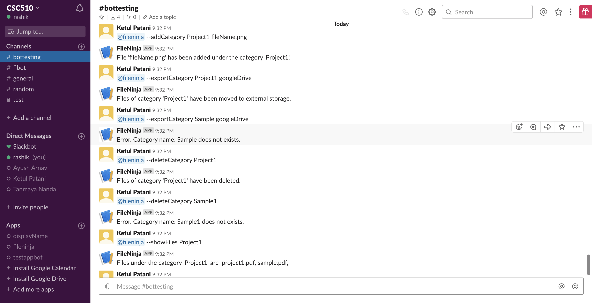

# FileNinja

## Bot Platform Implementation
We have used a Node.js library "slackbots" to create our slack bot, 'FileNinja'. For our bot implementation we have architectured our code into the following layers: a routing layer, controller layer, service layer and database layer. When a user asks the bot to perform a specific task, the request makes contact with the routing layer (our ‘index.js’ file) which is listening for the “message” event and depending on the command this layer routes it to the appropriate controller. Each controller handles the logic for each individual command. We broke down the individual actions of the bot into reusable services and put them in our service layer. The controller decides which code path the bot will take, depending on the command given by the user and along the way it uses the services defined (currently mocked) in the service layer. This service function helps us generate the appropriate response for the bot. We have implemented code paths for all possible scenarios (both positive and negative) and at the end of each path we generate an appropriate reply for the bot. Service layer makes use of the database layer to make calls to the DynamoDB and Google drive (Currently, we have mocked those API calls. * All code can be seen inside the ‘src’ folder).  

Currently, we have a fully functional bot which responds to the user commands. To do so we have added the bot to our slack workspace, so whenever a user wants to use the bot, it can interact with the bot by '@fileNinja and then the command'. Anyone can clone the repository and then run 'npm install' to install all the required packages to run the server. Then the user can enter there BOT_TOKEN in the ‘.env’ file and then run 'npm start' to start the server.  
Note: FileNinja uses these packages:   
- slackbots  
- aws-sdk  
- pdf-lib  
- Selenium-webdriver  
- got  
- node-fetch  
- mocha  
- nock  
- aws-sdk-mock  
- nodejslack  

Here is a screenshot showing a conversation between a user and our bot:  

  

## Use Case refinement

We have made some modifications to our use cases. Our reason for modifications is: Slack allows multiple uploads with same file name. This would lead to a problem for the Bot in choosing which files to use for the requested operation. Hence, our modifications will remove singular file operations. The following are the changes: 
    1. USE CASE: *Export files under a specific category* 
    Before modification, user had the option to export files in category by specifiying file name using the command: @botName --export fileName externalStorageName. Currently, user can only export the entire category and the files in it will be exported too using the command: @botName --export categoryName externalStorageName 
    2. USE CASE: *Delete files under a specific category* 
    Before modification, user had the option to delete file in a category by specifying filename and category name using the command: @botName --deleteCategory categoryName fileName. After modification, user may only delete the entire category using the command: @botName --deleteCategory categoryName 
    3. USE CASE: *Add Watermark to file* 
    Before modification, user had the option to watermark file anytime after uploading by asking File bot through the message: @botName --addWatermark watermarkName fileName. However, since multiple files could be uploaded using same file name, Bot wouldn't know which file (with given filename) to add the watermark to. Hence, only when user uploads a file, it can ask the Bot to watermark it. Our modication thus allows adding watermark during the file upload itself.
## Selenium testing

We have used a web browser automation framework Selenium to conduct the User interface test. This framework helps to pose as a user and conducts the test. It also verifies the output for the commands given by the user on the text box in the channel. 
Currently, we have implemented test cases for major features of file bot: Watermark, Storage management, Category management and External storage. Each feature has sub-categories which are also tested and these tests have a happy path and one alternate path. Let's go over the test cases.

1. Watermark
    - USE CASE: *Register Watermark* 
        The happy path here, tests for registering a watermark when file format is correct.
    - USE CASE: *Register Watermark when no image provided* 
        This test is for registering a watermark but user did not provide/upload an image to be used as watermark. This is expected to fail.
    - USE CASE: *Register Watermark for unacceptable file format*   
    This is an alternate path for the previous test. This tests for registering a watermark when a user uploads an unacceptable format which is jpeg
        in this case. 
    - USE CASE: *Add Watermark to file* 
        This test case tests for adding watermark to file. Acceptable file formats is PDF only. 
    - USE CASE: *Add Watermark to file which is not PDF* 
        As an alternate path to the previous test, this test case tests for adding watermark to file when user did not provide a PDF file. It is expected to fail.
    - USE CASE: *Add Watermark when no file provided* 
        This test case tests for adding watermark to file when user did not provide a file name. It is expected to fail.
    - USE CASE: *Get all watermarks* 
        This tests for listing all registered watermarks.

2. Storage Management  
    - USE CASE: *Set storage limit* 
    This tests is for setting storage limit when user specifies a storage limit <=5.0. 
    - USE CASE: *Set greater storage limit* 
    This tests is for setting storage limit when user specifies a storage limit > 5.0. Here, the test expectedly fails.
    - USE CASE: *Set storage limit with non-integer parameters* 
    This tests is for setting storage limit when user specifies a non-integer storage limit. Here, the test expectedly fails. this is an alternate path for our previous test.
    - USE CASE: *Get current storage limit* 
    This test simply tests for current storage limit.

3. Category Management and External Storage 
    - USE CASE: *Register category with params* 
    This is the first command the user needs to give to create a category where it can add files. 
    - USE CASE: *Register category that already exists* 
    This tests if any user gives the same category name again and the Bot responds by saying the category name already exists.
    - USE CASE: *Add files to category* 
    This tests when a user wants to add files to a category created.  
     - USE CASE: *Show files in a category* 
    This represents a happy path. This tests the case when user asks to list all files in a category. 
     - USE CASE: *Show files a category which does not exist* 
    This tests the case when user gives a non-existing category name to list all files in it. This test expectedly fail.  
    - USE CASE: *Delete a category* 
    This tests the case when user deletes the category.
    - USE CASE: *Delete a category which does not exist* 
    This tests the case when user deletes the category but the category does not exist.
    - USE CASE: *Export category to external storage* 
    This represents a happy path. This test case tests when user exports the category to external storage for better storage management. 
    - USE CASE: *Export category for a category which does not exist* 
    This test case tests when user exports the category to external storage but gives a category name that is not created. The test will expectedly fail in this case.
    
To summarize, we have written tests for happy paths and alternate (error) paths for the various scenarios mentioned above. The selenium files can be found at [selenium.js](../src/test/selenium.js)

## Mock Infrastructure
#### Mocking HTTP and third party calls:
For mocking HTTP and third party calls we have used nock.js, which is a server mocking and expectations library for Node.js.
It overrides Node's http.request functionality and creates an interceptor list which is used to mock any request made to the URL present in the list. The scope for it's use in our project is that it mocks calls like GET/POST request to slack to fetch a resource, or other HTTP and third party requests. Since nock.js allows us to set custom response for the mocked calls, we use the mocked data from a JSON file called mock.json, where we have hardcoded the response values for various calls. Nock.js also allows us to mock responses containing files. We use this feature to return dummy files when we fetch a resource from slack. We store these dummy files inside the test_files folder.

#### Mocking Database calls:
For mocking database calls, we decided to go with aws-sdk-mock. It is a mocking library for AWS DynamoDB, which is the database we plan to use in the future. It mocks the call and response to and from the DynamoDB respectively. It also allows us to set custom response data and status which it then passes it into the callback function defined for a given call. The advantage of doing this is that it will make transition towards the actual implementation of DynamoDB much simpler. Secondly,It helps us set up the database layer just as we would for the real DynamoDB call, without actually interacting with the database. The mocked response it picked up from the mock.json file for all the different database calls like 'get', 'getAll' etc.

#### Mocking Data:
All mocked data and responses for HTTP and Database calls have been hardcoded and stored in mock.json in JSON format. All the files (dummy .pdf, .png etc files) for mocking are present in the test_files folder.
