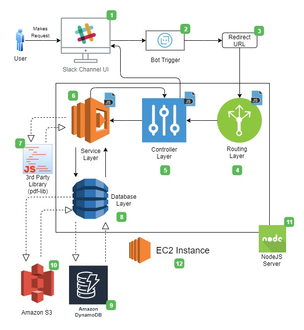
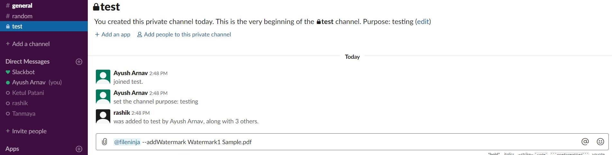
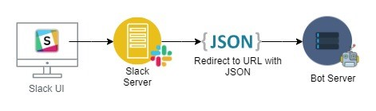
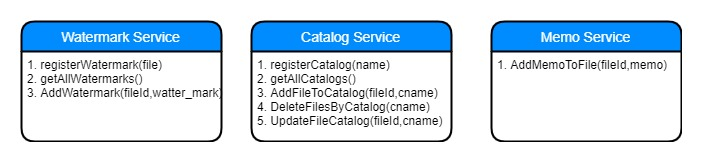
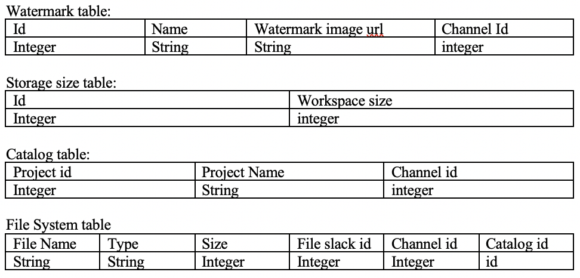

# Design

## Problem Statement:
In daily life, we come across various ways and processes to store files. It can be maintaining bank account details, salary details, payment details, student information, student reports, books in the library etc. File management and processing is a tedious job which consists of a lot of manual steps which take up a lot of time and introduce human errors. When latency and human error is considered for the file system, they have a tendency to accumulate and become a serious problem.

## Bot Description:
**Tagline** - **FiBot**, one stop bot for File Processing.\
\
We propose a bot which can chat in spoken english with the user and understand the user’s need. The bot can act upon the input and automate the process of handling files and processing them, saving both time and removing human errors. Slack is a fast growing platform for team collaboration leading to sharing of files amongst them. File upload is an important functionality on Slack and it also gives us the functionality to build a bot to search channels, messages and members or talk to a user. We take advantage of these abilities to make the bot understand what the user wants. The Bot responds to user's instructions, maintains a memory and knows the user, it can be categorised under 'Responders'.

### Bot’s Functionality:
- Sharing link generation: Bot can generate temporary or permanent link to share files.
- Compressing/ decompressing file: Bot can take files from the user to zip or unzip files.
- File Versioning: Bot can help keep different versions of the file.
- Watermarking: Bot can help to watermark documents.
- Basic file operations: Bot can perform file operation on file saved on slack like deleting a file from slack when asked.

## Architecture Design:

The diagram below illustrates the architecture, components of our bot along with the platforms that each component is embedded in

               Figure : Architecture Design of FileNinja

### Component Breakdown:
The breakdown of the numbered components in the figure are as follows: 

1. The platform on which the user will interact with the bot will be slack. More specifically a slack channel, where the bot will be present as a channel member, waiting for instructions.
2. Once the user hooks the bot in chat with something like "@FileNinja --addWatermark Watermark1 Sample.pdf", the bot will become activated. The following figure shows what it will look like:

                 Figure: Triggering the Bot
3. The way the above step works is that when the the message is sent with the tagged bot, the request along with the message is sent to the Slack server where it subsesequently creates a JSON object with message and further redirects to the URL of the bot server.

                 Figure: Redirection to Bot Server URL
4. Next the request will reach our server where it will begin its interaction at the routing layer which is essentially the index.js file. Here it will listen to the request and based on the type of message in the received JSON, it will instantiate the corresponding controller.
5. The controller layer is where the business logic of the bot will be present. Each feature like Adding Watermark, Cataloging files,adding memo and setting storage limit will have a separate controller with their corresponding logic. These will be written in JavaScript.
6. The controller logic will use the services in the Service layer to perform atomic actions like registerWatermark(), getAllWatermarks(), getAllCatalogs() etc. The Service layer will also be in JavaScript.

                  Figure: Service layer functionality

7. The Service layer will be using and have dependencies on third party libraries like pdf-lib and pdf.js.
8. The Database layer will have code in JavaScript to directly interact with the database and perform CRUD operations like createWaterMark(), createStorageWarning(), createCatalog() etc.
9. The database which we will be using for this project is Amazon DynamoDB. The structure of the database tables we will be using is as follows:

                  Figure: Database Table Structure
10. We will be using Amazon S3 to store the actual image file for watermark. The url of this file will be present in the dynamoDB Watermark table.
11. All the server components shown in the figure (inside the rectangular box) will on a NodeJS Server.
12. NodeJS Server will itself be hosted and deployed on an Amazon EC2 instance.

### Constraints:
1. The bot cannot watermark registered in channel in another channel as the watermark itself maybe sensitive, like a authoritative seal.
2. The bot cannot modify orignal file for watermarking. It will create an additional copy with the watermark.
3. The Bot cannot interact or send data between channels or users.
4. The Bot will not catalog files unless asked to do so.