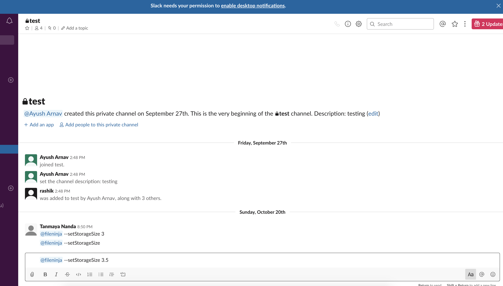
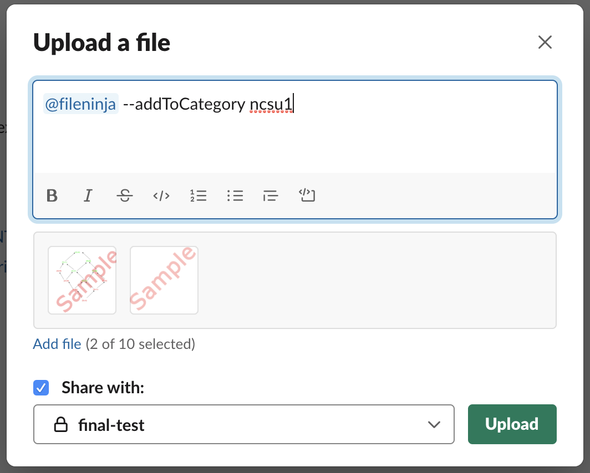
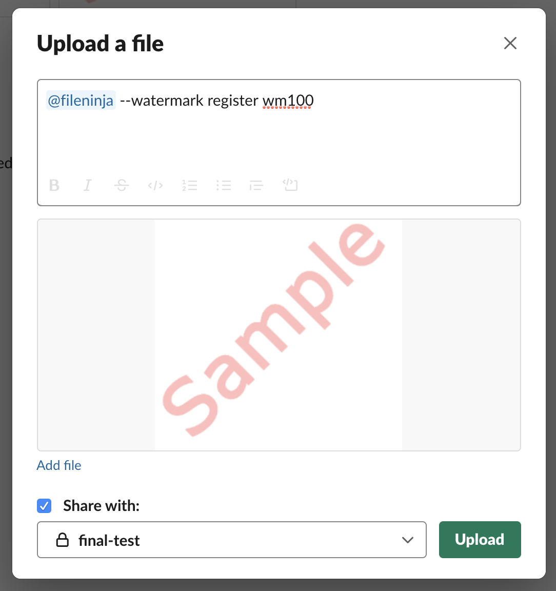
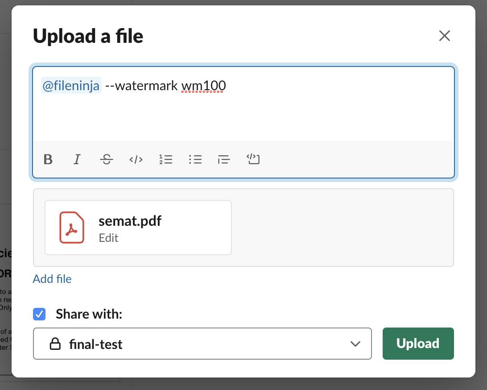
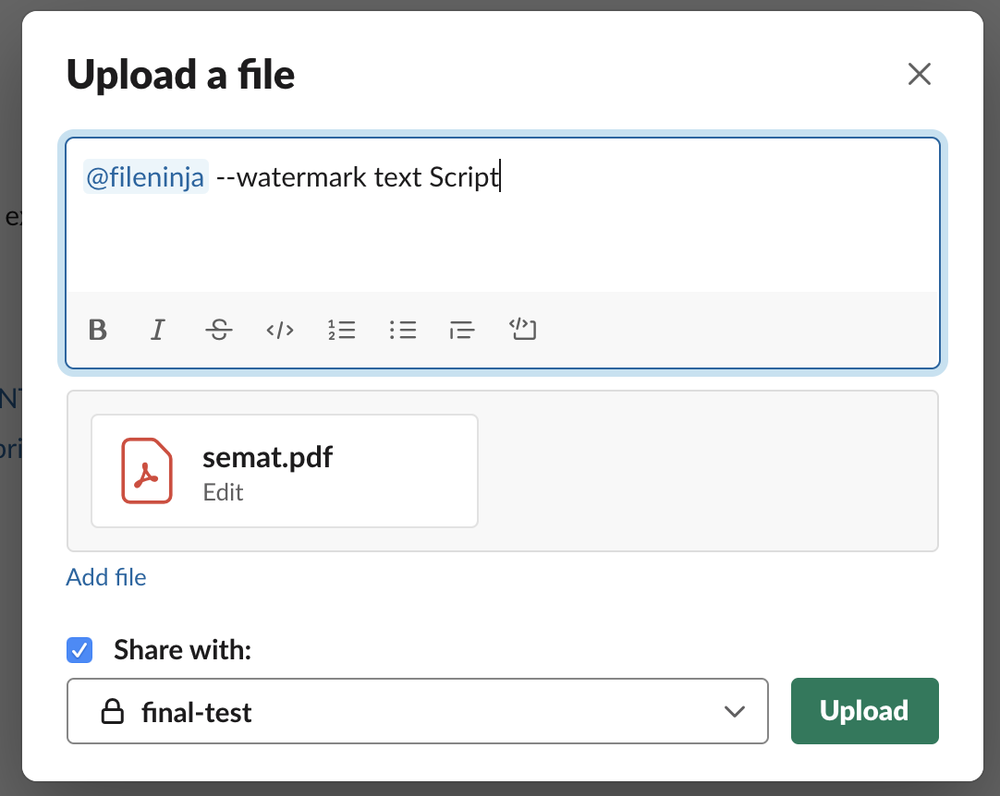
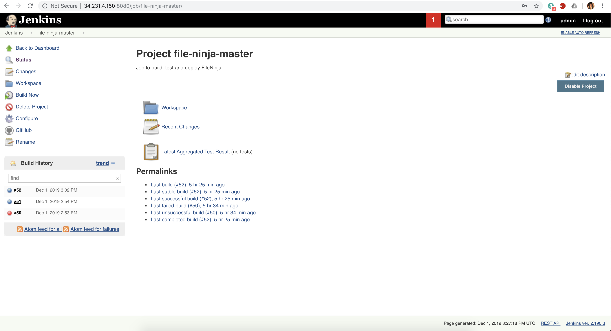

### Deployment Instructions

Our application will be deployed to AWS environment. The application will run on a remote EC2 instance. 
1. Login to AWS and obtain an EC2 machine. 
2. The EC2 should have IAM role access for DynamoDb. 
2. Remote login to the EC2 instance using AWS credentials. 

3. Once inside the EC2 instance, follow the next steps.
    1. Install Ansible in the EC2 instance. Most EC2 machines come with pre-installed Ansible. If not, install using:<br>
    ``` sudo pip install ansible ``` (Linux) or,<br>
    ``` sudo apt-get install ansible -y``` (Ubuntu)
    1. ``` git clone https://github.ncsu.edu/csc510-fall2019/CSC510-7.git```
    2. Enter into the cloned repo<br>
    ``` cd CSC510-7/src```
    3. Create a new .env file inside this (CSC510-7/src) folder:<br>
    ``` vi .env```
    4. In .env file, put the following variables.<br>
       ``` 
        USER_SLACK_TOKEN=
        BOT_ID=<@UNTLFGFB8>
        ADMIN_TOKEN=
        ```
    NOTE: Obtain the USER_SLACK_TOKEN from https://api.slack.com/custom-integrations/legacy-tokens. You will find a legacy-token
    in your slack user account.  
5. Run the ansible playbook:<br>
    ``` ansible-playbook CI-CD/deploy.yml -i hosts.yml```
6. Wait for the Ansible to finish setup.


### Acceptance Testing

1. Navigate to CSC510-7/src
2. Run:
    ``npm install``
3. Run:
    ``node index.js``
4. Now, go to the following link (Slack channel URL): <br>
https://app.slack.com/client/TNTGTLN5U/CNK1N4V5F

5. Once inside the channel, start typing the following commands to
verify the use cases by typing the commands in text box. As shown in the screen shot below, enter 
commands in the textbox at the bottom to start interacting with bot.

    *USE CASE 1: Storage*
    
    - Set a new storage limit.
    
       ``@fileninja --setStorageSize 3.5``
    
        Bot Reply: ``New Alert Limit has been set to 3.5 GB``
        
        Enter text/command as shown:
        
        
        
    - Get current storage limit.
    
       ``@fileninja --getStorageSize``
    
        Bot Reply: ``Current alert limit is 3.5 GB``
        
    - Trying to set storage grater than 5.0 GB will give an error as Slack doesn't allow storage more than 5.0 GB.
        ``@fileninja --setStorageSize 6``
        
        Bot Reply: ``Error. Size limit cannot be more than 5.0``
        
    - Trying to set a storage without numerical value will give an error.
    
        ``@fileninja --setStorageSize five``
        
        Bot Reply: ``Please enter a number for storage size(in GB).``
        
    *USE CASE 2: Category*
    
    - Register a category called 'ncsu1'. A category will hold files in it.
    
        ``@fileninja --registerCategory ncsu1``
    
        Bot Reply: ``Category registered.``
    - Trying to register a category again will give an error.
     
        ``@fileninja --registerCategory ncsu1``
    
        Bot Reply:
        ``Category with name ncsu1 already exists in this channel``
    - Register a category called 'ncsu2'
    
        ``@fileninja --registerCategory ncsu2``
    
        Bot Reply: ``Category registered.``
        
    - Fetch all categories in the channel.
        
        ``@fileninja --getCategories``
    
        Bot Reply: 
        ``Categories for this channel are: ncsu1,ncsu2``
        
    - Click on upload button to upload files, add one or more files with names such as file1.png, file2.png
      In the upload message box, add the below command to add the files to category ncsu1.<br>
    
        ``@fileninja --addToCategory ncsu1``
        
        Bot Reply:
        ``File added to category.``
        
        Adding multiple files to category:
        
    - Repeat the above for ncsu2. Click upload button and upload the two files as above.
    
       ``@fileninja --addToCategory ncsu2``
    - To see the files uploaded to ncsu1:<br>
    
       ``@fileninja --showFiles ncsu1``
        
        Bot Reply:
        
        ```
          file1.png: https://files.slack.com/files-pri/TNTGTLN5U-FR4EWH01J/file1.png
          file2.png: https://files.slack.com/files-pri/TNTGTLN5U-FR751GCSJ/file2.png
        ```
    - To see files in a category which doesn't exist.
    
        ``@fileninja --showFiles ncsu3``
    
        Bot Reply: ``Error: No category with the name ncsu3 exists``
        
    - Delete a category in the channel. This will delete all files in that category too.
        
        ``@fileninja --deleteCategory ncsu1``
    
        Bot Reply: ``Files of category ncsu1 have been deleted``
    -   Export files in ncsu2 to google drive named 'test'
    
        ``@fileninja --exportCategory ncsu2 test``
        
        Bot Reply: ``Files of category 'ncsu2' have been exported.``<br>
        Files get exported to external google drive.
        
    *USE CASE 3: Watermark*
    
    -  Upload a suitable .png image to be used as watermark. Select only one image to register as watermark. In the upload message box write the message to
    register this image as watermark.<br>
        ``@fileninja --watermark register wm100``
   
        Bot Reply: ``Watermark created successfully.``
        
        Registering a watermark:
        
        
    - Watermark a file with image. This image is a watermark image registered in previous step. Upload a suitable pdf file to be watermarked. In the upload message box write the message to
    add watermark to pdf.<br>
    ``@fileninja --watermark wm100``
       
       Bot Reply: Returns the pdf file with watermarked image.<br>
       ``File watermarked successfully.``
       
      Adding a watermark image to a file:
        
    
    - Watermark a file with a text. As shown in the previous step, upload a suitable pdf file to be watermarked. In the upload message box write the message to
    add text watermark (Script) to pdf.<br>
      ``@fileninja --watermark text Script``
       
       Bot Reply: Returns the pdf file with watermarked text.<br>
       ``File watermarked successfully.``
       
       Adding a watermark text to a file:
        
    - Fetch all watermarks in the channel.
    
        ``@fileninja --watermark list``
       
       Bot Reply: ``Watermarks for this channel are: wm100``
    
    - ``@fileninja --watermark register wm99``
       
       Bot Reply: ``No file associated with command. Upload a PNG file with command to create watermark.``
   
    - Upload a jpg file to register as watermark. It will fail as only .png files are accepted.<br>
        ``@fileninja --watermark register wm99``
       
       Bot Reply: ``Wrong format for file . Watermark only accepts .png files``

    - Without uploading any file, watermark command fails.<br>
        ``@fileninja --watermark wm100``
       
       Bot Reply: ``No file associated with command. Upload a PDF file with command watermark the file.`` 
      
### Screencast

[Screencast video](https://drive.google.com/open?id=1IZliBJ0fsQbgEFl-Zs3dY2j4Mru1YqcX)

    
### Continuous Integration (CI) Server

We have setup a Jenkins server on EC2 host. A Jenkins job is configured for File Ninja. Every 1 minutes, it polls the repo: https://github.ncsu.edu/csc510-fall2019/CSC510-7. When it detects new changes, it triggers a build that runs all the tests against the latest changes. If build passes, it starts the ansible-playbook that automates the deployment of latest changes to server. <br>

Jenkins URL: http://34.231.4.150:8080/job/file-ninja-master/<br>
user:admin<br>
password:csc510-7

<p align="center">

</p>


