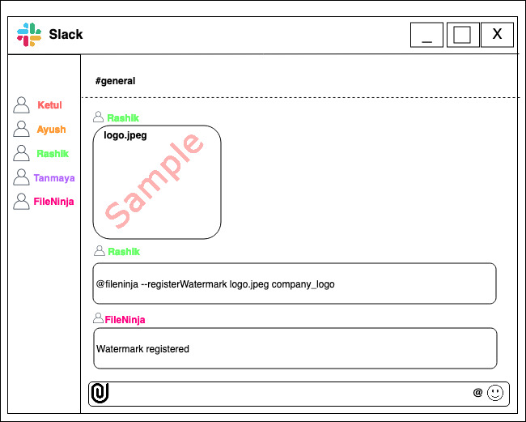
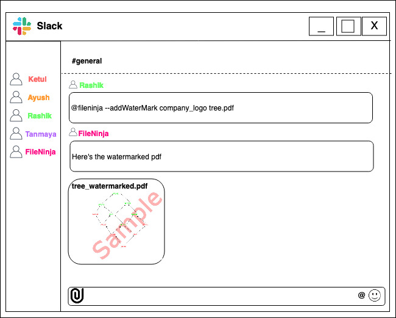
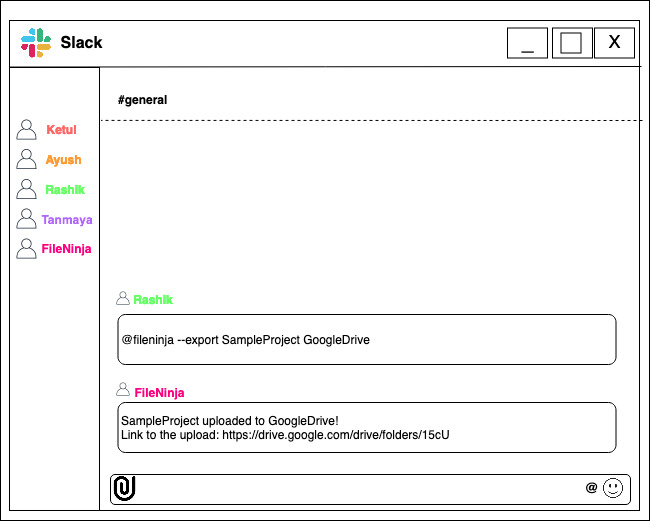
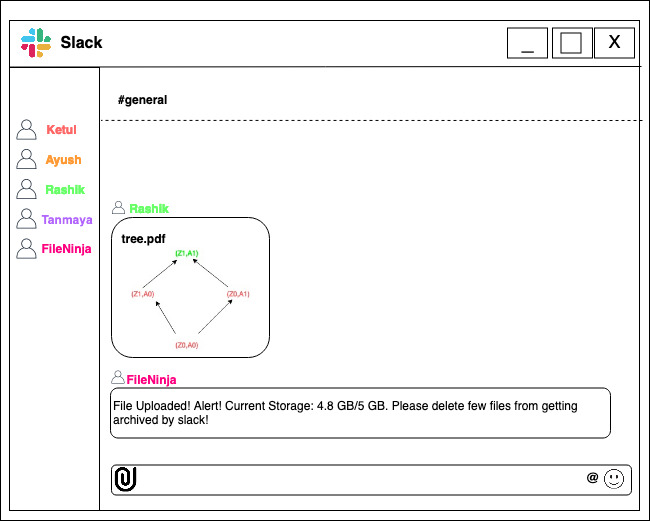
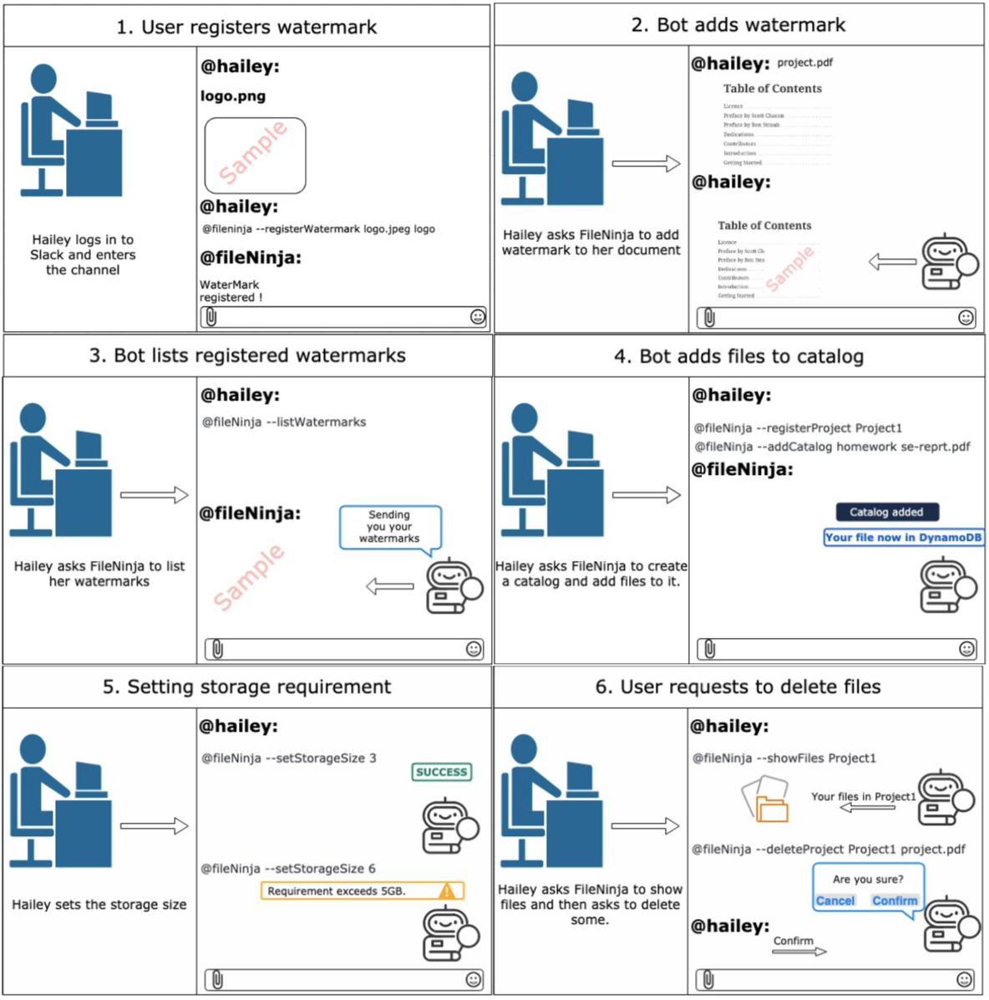
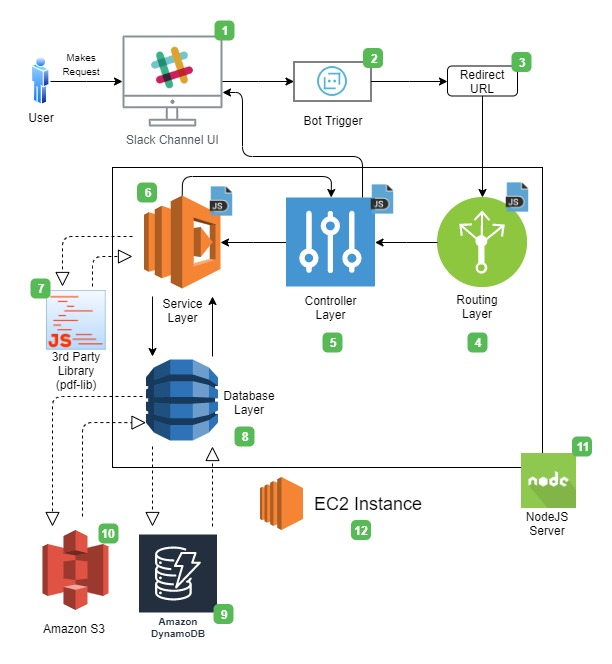
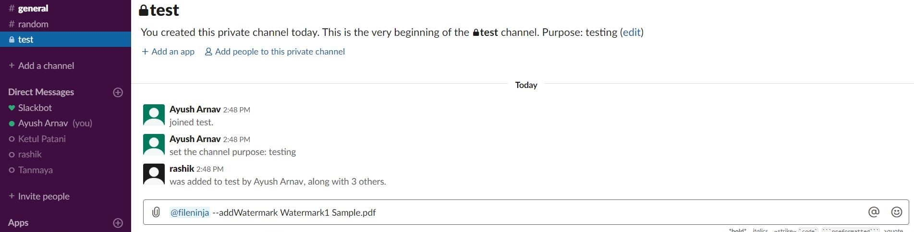
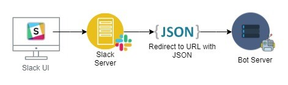
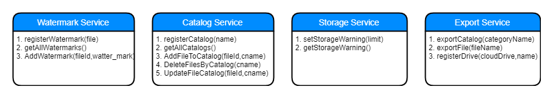
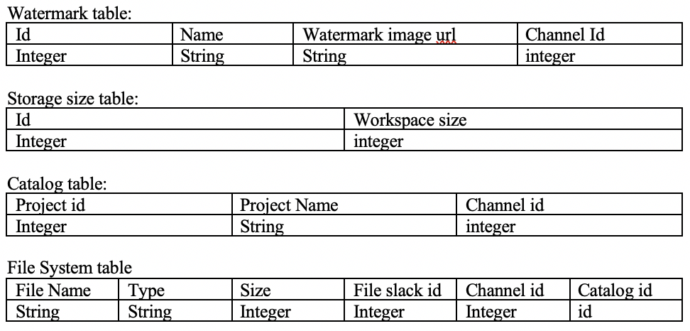

# Design

## Problem Statement:
This project solves the problem of file management on slack. First, in a company if there is a slack channel, everyone on the team is added to that slack channel even though a lot of people are working on different projects. So if someone wants to add a file to that slack channel and catalog that file into a folder/project, slack doesn't give them that flexibility. Also, Slack only allows 5GB storage in a workspace and because of this users can't see files which have been archived, as they have utilized the storage quota. Our bot will alert the users about this quota consumption.  
Currently, Slack archives older file when the storage limit is exceeded. The user has to pay extra to increase the storage or retrieve the older files. Our bot will allow the user to export an entire project/folder to an external cloud drive. The user can also have the option to delete or search via category.  
Finally, members want to add watermarks of their team or company on their official documents before sending it to someone else. Slack doesn't provide them the feature to do this on the go. The user has to download the file and then add watermark to it, using a 3rd party software which is usually not free.  

## Bot Description:
**Tagline** - **FileNinja**, one stop bot for File Management.

We propose a bot which can chat in english with the user and understand the user’s need. The bot can act upon the input and automate the process of handling files and processing them, saving both time and human errors. Slack is a fast growing platform for team collaboration, which allows sharing of files amongst members. File upload is an important feature on Slack and it also gives us the functionality to build a bot to manage these files on the go. We take advantage of these abilities to make the bot understand what the user wants. The Bot responds to user's instructions and maintains a memory. This bot can be categorised under 'Responders'.

### Bot’s Functionality:
- Watermarking: Bot can help to watermark documents.
- Storage Management:
  - The bot will give updates on the storage capacity limit (as set by the user) after every upload.
  - Can catalog file under at most one category( Eg. project or folder name). Currently, Slack only tags on the basis of file extensions, file name, date and content inside the file. It doesnt allow grouping on the basis of an external tag (like the project, the file is a part of).
  - Can Search and delete on the basis of a given category.
- Exporting catalog:
  - Currently, Slack archives older file when the storage limit is exceeded. The user has to pay extra to increase the storage or retrieve the older files.
  - The bot will have the feature to register external cloud drives with it.
  - The bot will allow the user to export the files of a given category to an external cloud drive, in it's entirety. It will then delete those files from the Slack database, hence, freeing up the workspace.  
  - Will provide an external link which will have the contents of that catalog in one location, making it easy to look up the files.

## Use Cases:
**USE CASE: Register Watermark**
1. Preconditions  
FileNinja is installed on slack.  
User is logged into slack and can chat with the bot.  
2. Main Flow  
User will upload an image[S1] and then tell the bot to keep this image as a watermark[S2] and will provide the name of the watermark[S2]. Bot saves the file in s3 and metadata in DynamoDB[S3].  
3. Sub Flows  
[S1] User uploads image  
[S2] User will give name to the watermark and ask the bot to save it with `@fileNinja --watermark SE-Project file1.png`(format is: `@botName --watermark watermarkName fileName`).    
[S3] Bot will save the file on S3 and makes an entry in database with name, file path and channel.  
4. Alternative Flows  
[E1] File is not in PNG or JPEG format then bot displays an appropriate message.  

**USE CASE: Add Watermark to PDF**
1. Preconditions  
User is logged into slack. FileNinja is installed on slack. User can chat with the bot.  
2. Main Flow  
User will upload the PDF[S1] and then request the bot to add watermark to the PDF with the name of the watermark to be added to the PDF [S2]. Bot will add watermark to the file and return a new file to slack with watermark added [S3].  
3. Sub Flows   
[S1] User uploads PDF.   
[S2] User will give name of the watermark to be added to the PDF as `@fileNinja --addWatermark SE-Project se-reprt.pdf` (format is: `@botName --addWatermark watermarkName fileName`).   
[S3] Bot will add watermark to the PDF, upload the watermarked PDF.    
4. Alternative Flows   
[E1] Watermark name or file name does not exist or is not in this channel then bot displays an appropriate message.  
[E2] File is not a PDF then bot displays an appropriate message.  

**USE CASE: Get all watermarks**
1. Preconditions  
FileNinja is installed on slack.  
User is logged into slack and can chat with the bot.  
2. Main Flow  
User will ask the bot to show the list of all watermarks added[S1] and bot then show the watermark list to the user [S2].  
3. Sub Flows  
[S1] User asks bot to list all watermarks with command `@fileNinja --listWatermarks`.   
[S2] Bot will query through DynamoDB and get all the watermarks for the specific channel user asked in and show them to the user.  
4. Alternative Flows  
[E1] If no watermark exists then bot displays an appropriate message.  

**USE CASE: Set storage warning sign**
1. Preconditions  
FileNinja is installed on slack.  
User is logged into slack and can chat with the bot.  
2. Main Flow  
User will tell the bot the maximum file storage for the workspace [S1], after which the bot should alert user for clean-up[S2] (maximum storage allowed by slack is 5GB). 
3. Sub Flows  
[S1] User will ask the bot to save the file storage limit as `@fileNinja --setStorageSize 3` (format is: `@botName --setStorageSize sizeInGB`).  
[S2] Bot will save the storage requirement in database.  
4. Alternative Flows  
[E1] Storage size given is more than 5GB then bot displays an appropriate message.  
[E2] If user doesn’t give any storage limit and uploads file, bot asks the user to either set it himself or the bot sets it to 3GB by default.  

**USE CASE: Register Project in catalog**
1. Preconditions  
FileNinja is installed on slack.  
User is logged into slack and can chat with the bot.  
2. Main Flow  
User will ask the bot to save the corresponding project name in catalog [S1]. Bot saves the name in DynamoDB[S2].  
3. Sub Flows  
[S1] User will give name to the project to be saved in catalog and asks the bot to save it with `@fileNinja --registerProject Project1` (format is: `@botName --registerProject projectName`).  
[S2] Bot makes an entry in database with corresponding meta data.  
4. Alternative Flows  
[E1] If project name already exists in catalog, then bot displays an appropriate message.  

**USE CASE: Give file a project tag**
1. Preconditions  
User is logged into slack. FileNinja is installed on slack. User can chat with the bot.  
2. Main Flow  
User will upload the PDF[S1] and then request the bot to give the PDF a tag from the catalog [S2]. Bot will save the file under the following tag and make an entry in database [S2].  
3. Sub Flows  
[S1] User uploads PDF.   
[S2] User will give name of the Catalog the file should be added in as `@fileNinja --addCatalog homework se-reprt.pdf` (format is: `@botName --addCatalog catalogName filename`).  
[S3] Bot will add watermark to the PDF and return it to slack.  
4. Alternative Flows  
[E1] Tag name or file name does not exist or is not in this channel then bot displays an appropriate message.  

**USE CASE: Show all files in a specific project**
1. Preconditions  
User is logged into slack. FileNinja is installed on slack. User can chat with the bot.  
2. Main Flow  
User will ask the bot to show all files under a specific tag/ project [S1]. Bot displays all corresponding files to the user [S2].  
3. Sub Flows  
[S1] User asks bot to list all files under a project with command `@fileNinja --showFiles Project1` (format is: `@botName --showFiles projectName`).  
[S2] Bot will get all the file names from the database and their paths and then show them to user.   
4. Alternative Flows   
[E1] Tag name does not exist then bot displays an appropriate message.  

**USE CASE: Delete files under a specific tag**
1. Preconditions  
FileNinja is installed on slack.  
User is logged into slack and can chat with the bot.  
2. Main Flow  
User will ask the bot to delete a single file or all files under a specific project [S1]. Bot will confirm once again and then deletes the files [S2].  
3. Sub Flows  
[S1] User asks bot to delete files under a specific project with command `@fileNinja --deleteProject Project1 se-report.pdf` (format is: `@botName --deleteProject projectName fileName`) or `@fileNinja --deleteProject Project1` (format is: `@botName --deleteProject projectName`) to delete all files in a project.  
[S2] Bot will confirm from user if he wants to delete the files or not, and if user says yes, bot will delete those files.  
4. Alternative Flows  
[E1] Catalog name or file name does not exist or is not in this channel then bot displays an appropriate message.  

## Design Sketches

### Wireframes:
#### Wireframe 1: Teammate registers a watermark and asks FileBot to use for watermarking

#### Wireframe 2: Teammate exporting a catalog to an external storage

#### Wireframe 3: FileBot alerting the user regarding the Slack's file storage quota

### Story Board:

## Architecture Design:

The diagram below illustrates the architecture, components of our bot along with the platforms that each component is embedded in:

  

### Component Breakdown:
The breakdown of the numbered components in the figure are as follows: 

1. The platform on which the user will interact with the bot will be slack. More specifically a slack channel, where the bot will be present as a channel member, waiting for instructions.
2. Once the user hooks the bot in chat with something like "@FileNinja --addWatermark Watermark1 Sample.pdf", the bot will become activated. The following figure shows what triggering the bot will look like: 

  

3. The way the above step works is that when the the message is sent with the tagged bot, the request along with the message is sent to the Slack server where it subsesequently creates a JSON object with message and further redirects to the URL of the bot server.The figure below illustrates the redirection to the bot server 

  

4. Next the request will reach our server where it will begin its interaction at the routing layer which is essentially the index.js file. Here it will listen to the request and based on the type of message in the received JSON, it will instantiate the corresponding controller.

5. The controller layer is where the business logic of the bot will be present. Each feature like Adding Watermark, Cataloging files, export catalog and setting storage limit will have a separate controller with their corresponding logic. These will be written in JavaScript.

6. The controller logic will use the services in the Service layer to perform atomic actions like registerWatermark(), getAllWatermarks(), getAllCatalogs(), exportCatalog() etc. The Service layer will also be in JavaScript.The figure beow displays the service layer functionalities 

  

7. The Service layer will be using and have dependencies on third party libraries like pdf-lib and pdf.js.
8. The Database layer will have code in JavaScript to directly interact with the database and perform CRUD operations like createWaterMark(), createStorageWarning(), createCatalog() etc.
9. The database which we will be using for this project is Amazon DynamoDB. The structure of the database tables we will be using is as follows:

  

10. We will be using Amazon S3 to store the actual image file for watermark. The url of this file will be present in the dynamoDB Watermark table.
11. All the server components shown in the figure (inside the rectangular box) will on a NodeJS Server.
12. NodeJS Server will itself be hosted and deployed on an Amazon EC2 instance.

### Constraints:
1. The bot cannot watermark registered in channel in another channel as the watermark itself maybe sensitive, like a authoritative seal.
2. The bot cannot modify orignal file for watermarking. It will create an additional copy with the watermark.
3. The Bot cannot interact or send data between channels or users.
4. The Bot will not catalog files unless asked to do so.  
5. The Bot will not export/archive files unless asked to do so.  

### Additional Design Patterns:  
1. Command Pattern: Our architecture will use Command Pattern as when a user gives a command to the bot, the request will go to the Routing Layer which will decide which controller to call, based on the type of user command.  
2. Observer Pattern: The system will also make use of the Observer Pattern. When a user gives a command to the bot on a channel, after completing the task, the bot will notify everyone on that channel.  
