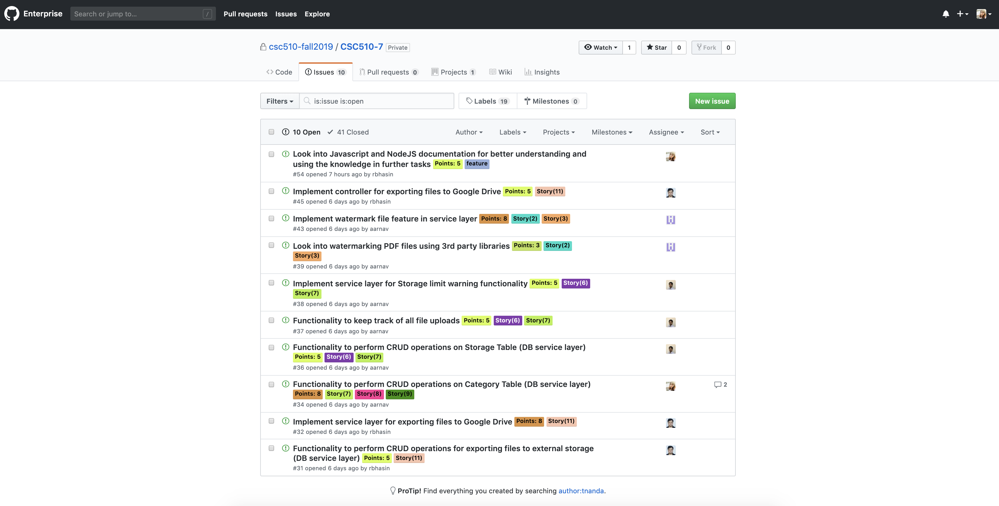

## Kanban Board

## Issues

### Open Issues

### Closed Issues

## Scrum Meetings

### 24th October, 2019
Everyone met to discuss what each member will be working on and created respective issues for the same. We created the storyboard and added labels and points to each issue as well. 

### 26th October, 2019
1. **Rashik**: Have been researching on how to integrate Google Drive with our Slack bot. I tried a few techniques to export files from my local machine to my Google drive and I have a working solution. Currently, I am uploading the file from a website, will try to get it to work with the bot as well. Simultaneously, I am looking into the delete functionality for files on Slack.
2. **Tanmaya**: I did some research on DynamoDB functionality and how to access and store keys and attributes for Category module. I replaced the old code that used mock framework for category service layer. I will write functionality for creating a category in db layer, implement service layer that sends data to db service. I will also implement controller methods to send data to service layer from index.js

3. **Ayush**: Setup the code base with basic file structures according to the architecture we decided on. Created required dynamoDB tables for all the features, namely, watermark, category, export and storage management with the help of a reusable script. Pushed the code as well.
Wrote the code for the database layer for watermark feature. Replaced the mock database calls with actual code for performing CRUD operations for watermark. Code can be looked for implementing their respective db layer service by other team members.
Implemented the controller and service layer for watermark functionality and checked its robustness for handling all code paths.
Added code to perform basic functionality like register and watermarking.
Added support for multi-page document watermarking.
Performed some refactoring by moving reusable code as common function to the service layer.
Finally, merged all my code with the master branch after testing.

4. **Ketul**: Setup EC2, DynamoDB & S3 on AWS to host the Slack bot. This includes setting up a VPC with an elastic ip and proper security group for the public availability for the security infrastructure.

### 28th October, 2019
1. **Rashik**: I have the code ready for ‘delete files of a category’ functionality in my local. I’ll pull the code pushed by Tanmaya and refactor my code based on it and then make a merge request to master branch. I have also created a separate account on Google for the team, everyone can use that account. I’ll be exporting the files to that account.
2. **Tanmaya**: I merged my branch 'dev/category' with master after I completed 'register category' functionality . I will implement functionality to add files to category. I will write controller methods, service layer logic and queries to save files to DynamoDB.

3. **Ayush**: Further researched on watermarking pdf files using third party libraries. Refined other service layers like slack_bot_service and watermark_service. Added additional checks to handle multi-file upload or no file upload with watermark command. Added check to determine if watermark with a name already exists in the database before registering it.Added validation to check the existence of watermark image before watermarking a file. Modified the schema for the ‘files’ database table.Finally, merged all my code with the master branch after testing.

4. **Ketul**: Since we are using AWS educate which allows a three hour session and updates the keys after that, I updated AWS infrastructure for passwordless authentication between AWS services by assigning IAM role to EC2 machine which can use IAM based policy routing to access service such as DynamoDB and S3. This allows to directly hit the required AWS service without access keys and secret keys. As we are hosting on AWS, in order to have cost efficiency, I updated the VPC infrastructure to allow EC2 to access S3 and DynamoDB via internal network avoid the public access charges of respective AWS services.

### 30th October, 2019
1. **Rashik**: I have merged the ‘delete files of a category’ functionality to master. I have tested it as well and it’s working fine. I have started coding the controller and service layer of “exporting files to Google Drive” functionality.
2. **Tanmaya**: I have merged 'add files to category' to master. I refactored some of the DynamoDB queries. There were some issues in adding files to category as same file names existed so, as Ayush modified the Db schema, I implemented the ‘add files to category’ feature. I will work on 'show all files in category' functionality today.

3. **Ayush**: Researched on adding, not just image but also text as a watermark. It turns out that this could be done with the help of 3rd party libraries like pdf-lib and JIMP. Worked with Rashik and Tanmaya to bash the bugs in export and category features. Wrote and merged the code for get_json_data_from_uri in the slack_bot_service file, as part of helping out Rashik in the export feature.Will work on refactoring my code further and making it as reusable as possible. Will fully implement the watermark features using the above mentioned libraries.
4. **Ketul**: Since slack return the file list in such a way that, multiple calls have to be made to get the total size of all uploaded file which can become a serious trouble if number of small sized file increases. And I have been looking into Slack File API to optimize the number of calls to achieve the result.

### 1st  November, 2019
1. **Rashik**: Have finished coding the service and controller layer of export files to Google Drive. For some reason the export functionality is not working at the moment. I am having an issue with the access token of Google Drive. I have asked a question on an open source project which was facing the same problem on how they resolved it, hopefully I’ll get a response by tonight. I am trying to resolve it on my own as well. 
2. **Tanmaya**: I merged functionality ‘show all files in a category’ to master. I formatted the Bot’s response to show both file names and URLs. I also looked into NodeJs documentation for refactoring methods. I will discuss with team on more CRUD functionalities to be that needs to be done for the next sprint.
3. **Ayush**: I worked on the text watermark feature using JIMP library. Worked on positioning the watermark image. Refactored some existing code as well. Will push it soon
4. **Ketul**: I am still looking into the Slack File API and parallely started working on CRUD functionality for DB service layer for Storage Table and will create a separate branch for it.

