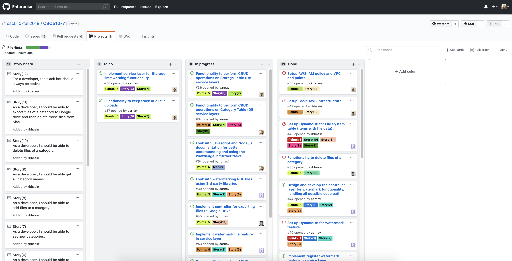

# Process

## First Iteration
In this iteration, we sat together and discussed all possible paths for all the use cases. In order to have everyone to work at their own pace, we decided that each member would take up one vertical(epic). We then determined the user stories for each epic and created tasks for each user story which were then added to Github Kanban Board with an appropriate score. The score was decided on the basis of the approximate time that would be taken to complete the task, hierarchy of the task in our architecture i.e. whether this feature needed to be implemented before implementing other dependent features.
During this iteration, we faced issues with adding entities like image & text to already existing PDFs through javascript and difficulty in understanding how promises and async calls work while implementing file upload and download tracker. We had a special meeting to tackle these issues, and were able to resolve it with the help of little brainstorming. By the end of the first iteration, each member completed the tasks assigned to them, thereby keeping us on track.

## End of First Iteration
### Kanban Board

### Issues
#### Open Issues

#### Closed Issues

## Second Iteration
In this iteration, we focussed on features we needed to show in the demo, more specifically we concentrated on inter-feature workability. Since each team member was working on his/her vertical we now began the process of syncing these features together and see how they performed together. For example, Ketul was working on file storage warning feature and Ayush was working on the Watermark feature which involved uploading files, so they worked together to test how well these two features work in sync i.e. was a file being uploaded as a watermark triggering the file storage alert? Similarly, Tanmaya was working on add files to category feature and Rashik was working on exporting files in that category to the external storage drive, as you can see one feature is dependent on other, so they sat down and integrated their code together to see how well their features performed together. During the end of the iteration, we also had a dedicated bug bashing session where we tried to resolve the known bugs which had accumulated until now. We also had pair programming sessions to help each other out.

## End of Second Iteration
### Kanban Board

### Issues
#### Open Issues

#### Closed Issues

## Scrum Meetings

### 24th October, 2019
Everyone met to discuss what each member will be working on and created respective issues for the same. We created the storyboard and added labels and points to each issue as well. 

### 26th October, 2019
1. **Rashik**: Have been researching on how to integrate Google Drive with our Slack bot. I tried a few techniques to export files from my local machine to my Google drive and I have a working solution. Currently, I am uploading the file from a website, will try to get it to work with the bot as well. Simultaneously, I am looking into the delete functionality for files on Slack.
2. **Tanmaya**: I did some research on DynamoDB functionality and how to access and store keys and attributes for Category module. I replaced the old code that used mock framework for category service layer. I will write functionality for creating a category in db layer, implement service layer that sends data to db service. I will also implement controller methods to send data to service layer from index.js

3. **Ayush**: Setup the code base with basic file structures according to the architecture we decided on. Created required dynamoDB tables for all the features, namely, watermark, category, export and storage management with the help of a reusable script. Pushed the code as well.
Wrote the code for the database layer for watermark feature. Replaced the mock database calls with actual code for performing CRUD operations for watermark. Code can be looked for implementing their respective db layer service by other team members.
Implemented the controller and service layer for watermark functionality and checked its robustness for handling all code paths.
Added code to perform basic functionality like register and watermarking.
Added support for multi-page document watermarking.
Performed some refactoring by moving reusable code as common function to the service layer.
Finally, merged all my code with the master branch after testing.

4. **Ketul**: Setup EC2, DynamoDB & S3 on AWS to host the Slack bot. This includes setting up a VPC with an elastic ip and proper security group for the public availability for the security infrastructure.

### 28th October, 2019
1. **Rashik**: I have the code ready for ‘delete files of a category’ functionality in my local. I’ll pull the code pushed by Tanmaya and refactor my code based on it and then make a merge request to master branch. I have also created a separate account on Google for the team, everyone can use that account. I’ll be exporting the files to that account.
2. **Tanmaya**: I merged my branch 'dev/category' with master after I completed 'register category' functionality . I will implement functionality to add files to category. I will write controller methods, service layer logic and queries to save files to DynamoDB.

3. **Ayush**: Further researched on watermarking pdf files using third party libraries. Refined other service layers like slack_bot_service and watermark_service. Added additional checks to handle multi-file upload or no file upload with watermark command. Added check to determine if watermark with a name already exists in the database before registering it.Added validation to check the existence of watermark image before watermarking a file. Modified the schema for the ‘files’ database table.Finally, merged all my code with the master branch after testing.

4. **Ketul**: Since we are using AWS educate which allows a three hour session and updates the keys after that, I updated AWS infrastructure for passwordless authentication between AWS services by assigning IAM role to EC2 machine which can use IAM based policy routing to access service such as DynamoDB and S3. This allows to directly hit the required AWS service without access keys and secret keys. As we are hosting on AWS, in order to have cost efficiency, I updated the VPC infrastructure to allow EC2 to access S3 and DynamoDB via internal network avoid the public access charges of respective AWS services.

### 30th October, 2019
1. **Rashik**: I have merged the ‘delete files of a category’ functionality to master. I have tested it as well and it’s working fine. I have started coding the controller and service layer of “exporting files to Google Drive” functionality.
2. **Tanmaya**: I have merged 'add files to category' to master. I refactored some of the DynamoDB queries. There were some issues in adding files to category as same file names existed so, as Ayush modified the Db schema, I implemented the ‘add files to category’ feature. I will work on 'show all files in category' functionality today.

3. **Ayush**: Researched on adding, not just image but also text as a watermark. It turns out that this could be done with the help of 3rd party libraries like pdf-lib and JIMP. Worked with Rashik and Tanmaya to bash the bugs in export and category features. Wrote and merged the code for get_json_data_from_uri in the slack_bot_service file, as part of helping out Rashik in the export feature.Will work on refactoring my code further and making it as reusable as possible. Will fully implement the watermark features using the above mentioned libraries.
4. **Ketul**: Since slack return the file list in such a way that, multiple calls have to be made to get the total size of all uploaded file which can become a serious trouble if number of small sized file increases. And I have been looking into Slack File API to optimize the number of calls to achieve the result.

### 1st  November, 2019
1. **Rashik**: Have finished coding the service and controller layer of export files to Google Drive. For some reason the export functionality is not working at the moment. I am having an issue with the access token of Google Drive. I have asked a question on an open source project which was facing the same problem on how they resolved it, hopefully I’ll get a response by tonight. I am trying to resolve it on my own as well. 
2. **Tanmaya**: I merged functionality ‘show all files in a category’ to master. I formatted the Bot’s response to show both file names and URLs. I also looked into NodeJs documentation for refactoring methods. I will discuss with team on more CRUD functionalities to be that needs to be done for the next sprint.
3. **Ayush**: I worked on the text watermark feature using JIMP library. Worked on positioning the watermark image. Refactored some existing code as well. Will push it soon
4. **Ketul**: I am still looking into the Slack File API and parallely started working on CRUD functionality for DB service layer for Storage Table and will create a separate branch for it.

### 3rd November, 2019
1. **Ayush**: Basic text watermark functionality working. Got stuck with an opacity issue with text watermark.Text is superimposing on the pdf file, thereby hiding its content. Need to look at other libraries to find a workaround for adjusting the text opacity. Also, working on code to align both text and image watermarks.
2. **Ketul**: Finished and tested the CRUD db layer for the storage functionality, checked in the code in a separate branch.
3. **Rashik**: Finished the db layer for the export files to Google Drive’ functionality. Also, the issue that the access token wasn’t working is now fixed. Currently, the files are uploaded to the root directory of the drive. Need to add the functionality to create seperate folders for categories and delete the file records from DynamoDB.
4. **Tanmaya**: I finished the CRUD functionality for category. I merged my feature branch to master. I will work on project report and look into open issues before closing them.

### 5th November, 2019
1. **Ayush**: Finished the feature for adding text as a watermark. User can now add custom text as a watermark. Also, managed to fix the alignment and opacity issue with both image and text watermarks. Refactored code to reuse functions for image and text watermark. Have pushed all the code and merged it master as well. Plan further refactor the image and text watermarks. Had a discussion with Ketul regarding the DB structure and layer for storage limit functionality.
2. **Ketul**:  Had a discussion with Ayush regarding storage table structure and made changes the CRUD db layer for storage functionality. Tested the CRUD db layer; it’s working as expected.
3. **Rashik**: Have finished the part where after files are uploaded to the drive, the records are deleted from DynamoDB. Also, now the files of a category are being uploaded in the folder with the same name as category. Also export files is working in my local, I’ll push the changes once a bug is fixed. Currently because of async calls sometimes the folder is created after the files are push to the drive, so will look into that now.
4. **Tanmaya**: I closed some open issues under my name. I will discuss collaborate with Rashik and work on testing the category/export feature to see if it’s working end-to-end.

### 7th November, 2019
1. **Ayush**: Helped Rashik resolve the export functionality bugs in the form of pair-programming and finished watermark testing for demo. Resolved bug for listing registered watermarks.
2. **Ketul**: Sat with Rashik to integrate storage limit feature with export feature.
3. **Rashik**: Sat with Ayush and resolved the bug in the export functionality and merged the changes. Did an end-to-end testing of export and delete files of a category.
4. **Tanmaya**: I tested the Category management use cases thoroughly. I tested all the happy paths and alternate paths to make sure the usd cases are covered.

### 8th November, 2019
We met in the morning to test the system once more. After that we sat together and finished up the things which were left in [PROCESS.md](PROCESS.md).

## Practices followed

### Core Practices
Here are the following core practices that we incorporated while developing our bot:-  
*  **Sit Together**: We held scrum meetings every alternate day to know where everyone stood, and if anyone was stuck on a problem, we discussed amongst ourselves to come up with a solution. Each team member discussed their individual approach towards task and got a critical feedback from the rest of the team. After this discussion, we decided on one final way to go about that problem. We also decided on what everyone will work on until the next scrum meeting. This way we all were able to achieve our goals on time and learned about different approaches to handle a problem. We also pushed our scrum meeting notes to the [PROCESS.md](PROCESS.md) file everytime we met.   
*  **Energized Work**: From the beginning we have been considerate towards everyone's schedule and conducted meetings when everyone was free. For example, we had a scrum meeting on Google Hangouts when two of the team members had there mid-term the next day. Otherwise, we used to meet for approximately 2-3 hours every alternate day and decided on the time a day before. This way everyone was productive when we met.  
*  **Pair programming**: Sometimes we incorporated pair programming, when someone was working on a complicated task. For example, when Rashik was working on implementing the service layer of exporting files of a category to Google Drive, Ayush performed the role of the navigator and brainstormed with Rashik to complete the task. This way we were able to finish up our complicated tasks on time and everyone got to learn from other team members.  
 **The scrum meeting notes can be seen above.**

### Corollary Practices
Here are the following Corollary practices that we incorporated while developing our bot:-  
*   **Shared Code**: For software practices, we worked on a shared code repository on NCSU Github Enterprise. All the team members were assigned tasks at the beginning of the iteration. Before starting to work on the tasks, each team member had to pull the latest code from the master. To avoid working simultaneously on the Master branch, team members checked out and worked separately on their respective branches. A common practice that all team members followed was to thoroughly test the code and also test the dependencies with other features and then mark the feature as ready. When the feature was ready, the team member created a pull request. The pull requests were inspected by reviewing code changes and adding comments (if necessary) before getting approved for merging it into the Master branch. For example, when Ketul was given a task to create DB service layer for storage management feature, he started by creating a new branch and once he was done testing he opened a pull request which was approved later by Ayush after suggesting few changes. With regard to version control, our practice is similar to what is followed in the industry today. The open issues were also tracked and updated after a feature was completed by merging the pull requests. This practice allowed team members to work separately on their features and collaborated with other features, avoiding merge conflicts.

* **Incremental Deployment**: We followed an incremental build model where the code base is designed, implemented and tested incrementally until the application development is complete. Both development and maintenance were done simultaneously. Whenever a feature branch was merged to Master, the entire application was tested by integrating all the features to make sure it worked end-to-end and no new commits caused the application to misbehave. We decomposed our product into a number of components, each of which was designed and built separately (called builds). In addition, the development was done in two iterations where each iteration was passed through the requirements, design, coding and testing phases. The first iteration covered major features that were of high priority. After the first iteration, we conducted full regression testing. During this testing, faulty pieces of code and broken functionalities were identified and added to issues to be handled in the next iteration. In the second iteration, we added functionalities to the previous code until all design functionalities were implemented. For example, when Ketul was working on the Storage management feature. The feature deployment was done in multiple phases starting with deploying DB service layer then controller service layer then finally changes in the routing layer where each deployment was thoroughly tested.
